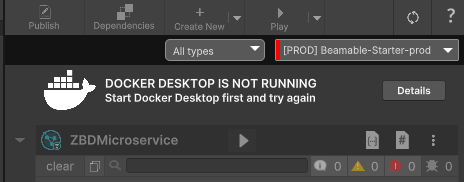
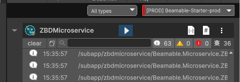

# Zebedee and Beamable Starter Project

**Quick Links**

- [Unity Setup](#setup-unity)
- [Beamable Setup](#setting-up-beamable)
- [Running microservices](#running-the-microservice)
- [Login with Zebedee](#zebedee-login)
- [Publishing your microservice](#publishing-your-microservice)
- [Troubleshooting](#troubleshooting)

## Package Overview

This is a starting point/reference package to show how to integrate Zebedee into your app using Beamable Microservices. There are two main demo scenes in this package, a general-purpose overview demo and a Login demo.

### [Zebedee Login Demo](#zebedee-login)

This demo scene is a working implementation of Zebedee login using Beamable Microservices on an Android device. Once configured this demo can be built to an Android device and tested out.

### [Microservices Demo](#zebedee-overview)

This shows how you can use Beamable microservices to integrate with Zebedee safely. There is a fully functional microservice that you can use in your project or use as a guide to create your own.

### UI Kit Demo

The UI Kit is a starting point for how the Zebedee integration can look in your app. We have provided assets to make the job easier.

There is a playable scene to demo the assets to see what the look and feel is like.

    💡 **NOTE:** There is no functionality in this demo. This is just to show UI elements that can be used in your projects.

---

### **Why use Beamable with Zebedee**

    To ensure the security of your game account on Zebedee, it is crucial to safeguard your API key and avoid exposing it within any client-side code. By leveraging Beamable in conjunction with Zebedee, you gain a seamless integration solution that allows for easy incorporation of Zebedee functionalities into your game. Leveraging the power of Beamable's microservices and Realm configurations, you can establish safe integration of Zebedee within your game environment.

---

## Setup Unity

     💡 This can be done on a new project or an existing one.

**Steps:**

1. Install Newtonsoft JSON
2. Install Beamable
3. Download and Install the Zebedee Unity Package
4. Install Docker Desktop

### Detailed instructions

Before starting with the Zebedee package we will need to get the project ready. We will need to install two dependencies in Unity:

- Newtonsoft JSON
- Beamable

**Start by installing Newtonsoft JSON:**

1. In Unity go to the package manager > install package by name > enter `com.unity.nuget.newtonsoft-json`
2. Click “Add”

    

**Next, install Beamable:**

You can follow the instructions here: [https://docs.beamable.com/docs/installing-beamable](https://docs.beamable.com/docs/installing-beamable)

### Log in to Beamable


**Next download the latest Zebedee Package from here:**

Go to the GitHub repository below and download the latest release `.unitypackage` file

[https://github.com/zebedeeio/beamable-starter/releases](https://github.com/zebedeeio/beamable-starter/releases)

To install the package just drag and drop the file into the Unity project explorer.

**Next, install Docker:**

[https://www.docker.com/](https://www.docker.com/)

     💡 Docker is needed to run and test the Microservice locally

## Setting Up Beamable

### Securely store your Zebedee API key

To interact with the Zebedee API, you must obtain an API Key from your Zebedee developer dashboard. If you are unsure about the process, you can refer to the following guide for step-by-step instructions: [https://zbd.dev/docs/dashboard/introduction](https://zbd.dev/docs/dashboard/introduction).

**After obtaining your API key**, the next step is to incorporate it into your project's Realm Configuration on Beamable. To facilitate this process, please refer to the provided guide that explains how to log in to Beamable and create a game: [https://docs.beamable.com/docs/installing-beamable](https://docs.beamable.com/docs/installing-beamable). If you are utilizing the Zebedee / Beamable starter project, you can skip the installation steps and proceed directly to logging in and creating a game.

In the Beamable dashboard in the left side menu go to “Operate” → “Config”


**Next, we will need to add a new config. Click on “+ Add Config”**


**Add two Config Values:**

| Namespace: | Key: | Value: | Notes: |
| --- | --- | --- | --- |
| ZebedeeAPI | clientsecret | your client secret | This is only needed for the Zebedee Login Example |
| ZebedeeAPI | apikey | your API key | This is needed for any interaction with the Zebedee API |


Here is an example of how your Realm configuration should look:


     💡 Note: To use sample microservice you must use the same namespace and key. On your microservice, these can be anything you want.

## Running the microservice

Before testing out the microservice we must first get it running locally.

In Unity go to Window > Beamable > Open Microservices Manager


Here you will see the ZebedeeMicroservice


> 💡 If you see this warning below make sure you have Docker installed.
>
> 

After you are done with your development you will need to publish your microservice to Beamable. This will allow it to be used from anywhere. Check out the [Publishing section](https://www.notion.so/Zebedee-Beamable-Integration-b4123eef49854b878e9635584cb3bdd4?pvs=21) below to learn more.

## Sample Unity Scenes

### Zebedee Overview

This scene is an interactive way to test out the microservice and how it can be used with Zebedee

To check out how to integrate the microservice with your code check out the “MyController.cs” file in the scripts directory.

**Code explanation:**

```csharp
// This code ensures that the beamable microservice is ready
var ctx = BeamContext.Default;
await ctx.OnReady;

// This line makes the call to the microservice
var result = await ctx.Microservices().ZebedeeMicroservice().GetWallet();

// Here we take the string and convert it to a response object
// The Zebedee sdk has a response object for all responses.
// This allows you to easily get the data you need.
var jsonObject = JsonConvert.DeserializeObject<GetWalletDetails_Response>(result);
```

**Getting configuration from Beamable:**

To get data that needs to be secure from Beamable as we do for the “apikey” and “clientsecret” you can reference the code in “Config.cs” and the “GetAPIKey” function in “ZebedeeMicroservice.cs”

```csharp
// This code gets the value stored at the given key from Beamable
public string ApiKey => _settings.GetSetting("ZebedeeAPI", "apikey");
public string ClientSecret => _settings.GetSetting("ZebedeeAPI", "clientsecret");
```

### Zebedee Login

This scene shows how you can integrate Zebedee login with an Android build.

This uses the microservice to communicate with Zebedee to let your users log in securely.

To use the demo you first need to add your Client ID from your Zebedee developer dashboard and add it to the login controller in the login demo scene:


Once you have added your client ID you can build it for Android.

Next, you will need to publish your microservice to Beamable. Once your microservice is published you will be able to use it from anywhere. Check out the [Publishing section](#publishing-your-microservice) to earn more:

To see how to integrate the Zebedee OAuth2 flow you can check out the “LoginController.cs” script. This handles the initial start of the login flow as well as the deep link.

This class Handles both the microservice calls as well as the application logic to implement this functionality in Unity.

### Publishing your microservice

When you are done developing and want to test on other devices you will need to publish your microservice to Beamable. We have only been using it locally to develop. But to access from anywhere else we will need to publish it.

In the microservices tab in Unity click on “Publish”


Make sure your microservice is toggled on in the publish window and then click “Publish”. This will publish your microservice to beamable and allow it to be accessed from anywhere.


To check the status of the microservice and to make sure it is running. Check out the microservices tab in the Beamable dashboard.


For more details on this project make sure to check out the Beamable documentation here: [https://docs.beamable.com/docs/microservices-distributing](https://docs.beamable.com/docs/microservices-distributing)

### Troubleshooting

### General Issues

If you are experiencing any issues here are a few things to check:

- **Make sure you are logged in to Beamable in the Unity Editor**


- **Make sure you have the correct game in Beamable selected in Unity**


- **Make sure you are in the correct Beamable Realm in Unity**


### 403 Errors

These issues are usually caused by an improper docker or microservice setup. A few steps to check are:

- **Docker is installed correctly and running**



- **The microservice is running locally when developing (this can be checked by the play button being highlighted in the microservices tab in Unity)**



- **If you are working a a “Publised microservice. Make sure the microservice is published and deploy to the correct realm from the Beamable dashboard.**

